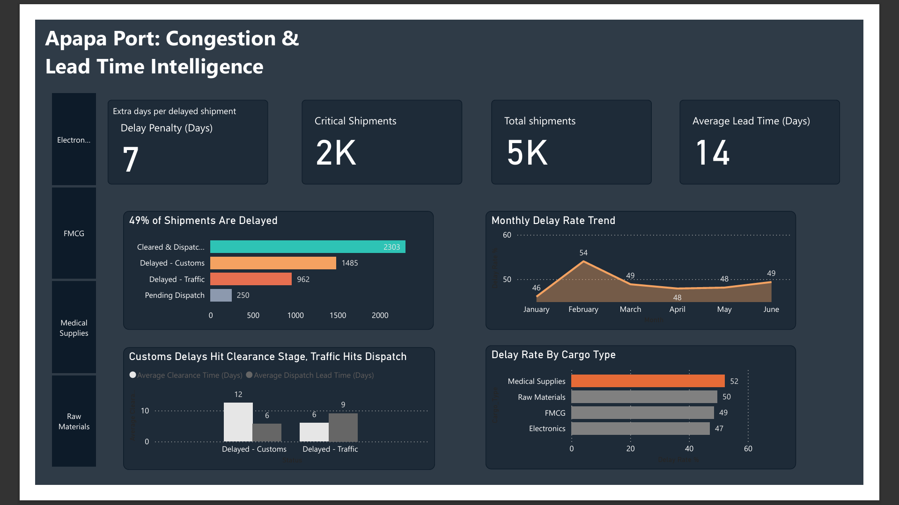

# Apapa Port Congestion & Lead Time Analysis

## Overview

This project analyzes shipment lead times, customs clearance bottlenecks, and delay patterns at Apapa Port — Nigeria's largest and busiest seaport. It combines supply chain domain knowledge with data analytics to surface structural congestion patterns and identify where interventions would have the highest impact.

The dataset consists of 5,000 synthetic shipment records generated with Google Gemini, covering December 2024 to July 2025. It was designed to reflect realistic operational patterns at Apapa Port.

**Note:** This is synthetic data generated for portfolio purposes. It does not represent actual Apapa Port operational data.

---

## Dataset

- **Records:** 5,000 shipments
- **Period:** December 2024 – July 2025
- **Original columns:** Shipment ID, Cargo Type, Container Size, Vessel Arrival, Customs Clearance, Truck Dispatch, Status
- **Cargo types:** FMCG, Electronics, Raw Materials, Medical Supplies
- **Container sizes:** 20ft, 40ft
- **Statuses:** Cleared & Dispatched, Delayed - Traffic, Delayed - Customs, Pending Dispatch

---

## Tools Used

- **Python (Google Colab)** — Data cleaning and feature engineering
- **SQL Server** — Exploratory data analysis
- **Power BI** — Dashboard visualization

---

## Phase 1 — Data Cleaning (Python)

Three issues identified and resolved:

1. All date columns stored as strings — converted to datetime format
2. 50 records had Customs Clearance dates before Vessel Arrival (physically impossible) — fixed by swapping the dates
3. 250 records had missing Truck Dispatch values — all corresponded to Pending Dispatch status, left as-is intentionally

Three engineered columns added:

- **Clearance Lead Days** — days from Vessel Arrival to Customs Clearance
- **Dispatch Lead Days** — days from Customs Clearance to Truck Dispatch
- **Total Lead Days** — full end-to-end shipment lead time

---

## Phase 2 — SQL Exploratory Analysis

### Lead Time Statistics

| Metric | Clearance Lead Days | Dispatch Lead Days | Total Lead Days |
| --- | --- | --- | --- |
| Maximum | 14 | 23 | 28 |
| Minimum | 2 | 1 | 3 |
| Average | 7 | 6 | 14 |

Dispatch Lead Days has the widest variance (1–23 days), suggesting truck logistics is the most unpredictable stage of the pipeline.

### Shipment Status Distribution

| Status | Shipments | Percentage |
| --- | --- | --- |
| Cleared & Dispatched | 2,303 | 46% |
| Delayed - Customs | 1,485 | 29% |
| Delayed - Traffic | 962 | 19% |
| Pending Dispatch | 250 | 5% |

### Delay Type Comparison

| Status | Shipments | % of Total | Avg Clearance Days | Avg Dispatch Days | Avg Total Days |
| --- | --- | --- | --- | --- | --- |
| Delayed - Customs | 1,485 | 29% | 12 | 6 | 18 |
| Delayed - Traffic | 962 | 19% | 5 | 9 | 15 |
| Cleared & Dispatched | 2,303 | 46% | 5 | 4 | 10 |

**Key insight:** Customs delays are the dominant bottleneck — 60% more cases than traffic delays, and 3 days longer per incident. The clearance stage is where customs-delayed shipments lose the most time (12 days vs 5 for traffic). Traffic delays compound at the dispatch stage (9 days vs 6 for customs).

### Clearance Lead Time by Cargo Type

| Cargo Type | Total Shipments | Avg Clearance Days |
| --- | --- | --- |
| FMCG | 2,033 | 7 |
| Raw Materials | 1,522 | 7 |
| Electronics | 966 | 7 |
| Medical Supplies | 479 | 8 |

Medical Supplies takes an extra 1 day to complete clearance on average compared to other cargo types, likely due to stricter inspection requirements for regulated cargo.

### Clearance Lead Time by Container Size

| Container Size | Total Shipments | Avg Clearance Days |
| --- | --- | --- |
| 20ft | 3,109 | 7 |
| 40ft | 1,891 | 7 |

Container size has no meaningful impact on clearance lead time. Congestion is uniform across both sizes.

### Delay Rate by Cargo Type

| Cargo Type | Delayed Shipments | Delay Rate |
| --- | --- | --- |
| Medical Supplies | 250 | 52% |
| Raw Materials | 755 | 49% |
| FMCG | 987 | 48% |
| Electronics | 455 | 47% |

Medical Supplies has the highest delay rate, consistent with its longer clearance times.

### Delay Rate by Container Size

| Container Size | Delayed Shipments | Total Shipments | Delay Rate |
| --- | --- | --- | --- |
| 20ft | 1,526 | 3,109 | 49% |
| 40ft | 921 | 1,891 | 48% |

Container size has no meaningful impact on delay rate. Congestion is uniform across both sizes.

### Monthly Delay Trend

| Month | Delayed | Total | Delay Rate |
| --- | --- | --- | --- |
| Jan 2025 | 422 | 916 | 46% |
| Feb 2025 | 422 | 781 | 54% |
| Mar 2025 | 425 | 870 | 48% |
| Apr 2025 | 387 | 808 | 47% |
| May 2025 | 406 | 844 | 48% |
| Jun 2025 | 385 | 780 | 49% |

The monthly delay rate sits consistently between 46% and 54% with no seasonal trend. Nearly 1 in 2 shipments is delayed every single month. This indicates the congestion is **structural, not seasonal**.

### Critical Shipment Threshold

Shipments with Total Lead Days ≥ 15 are flagged as Critical. The threshold was set at 1.5× the average lead time of healthy (Cleared & Dispatched) shipments (10 days × 1.5 = 15).

---

## Key Findings

1. **Customs is the primary bottleneck.** Delayed - Customs accounts for 29% of all shipments, averaging 18 days total and 12 days just in the clearance stage.
2. **Congestion is structural.** Delay rates are stable between 46–54% every month with no seasonal pattern, meaning the problem is systemic.
3. **Medical Supplies face the highest friction.** Highest delay rate (52%) and longest clearance time (8 days vs 7 for others).
4. **Dispatch is the most volatile stage.** Dispatch Lead Days range from 1 to 23 days, pointing to inconsistent truck availability and road congestion post-clearance.
5. **Container size is not a factor.** 20ft and 40ft containers experience near-identical delay rates and clearance times.
6. **The delay penalty is 7 days.** Delayed shipments average 17 days end-to-end vs the 10-day healthy baseline — a 7-day operational cost per delayed shipment.

---
## Dashboard Preview

---
## How to Replicate

1. Import `port_data_cleaned.csv` into SQL Server
2. Run queries from `/sql/apapa_port_exploratory_analysis.sql`
3. Connect SQL Server database to Power BI
4. Open `/powerbi/Apapa_Port_Dashboard.pbix`

